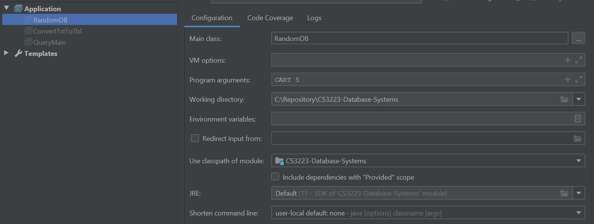
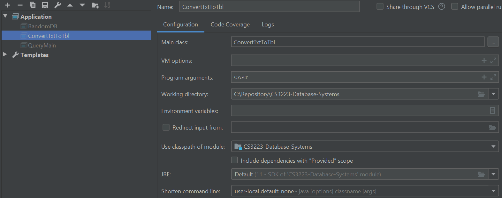
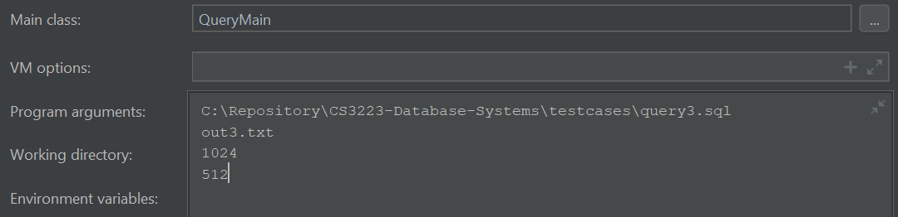

# CS3223-Database-Systems

### Running the program
1. configuration for RandomDB

set program arguments to `DBname numrecords`

2. run RandomDB and generate `.md .stat .txt` files

3. configure ConvertTxtToTbl 

set program arguments to `DBname`

4. run ConvertTxtToTbl and generate `.tbl` file

5. configure QueryMain

set program arguments to `queryfilename resultfile pagesize numbuffer`

6. run QueryMain and generate output file